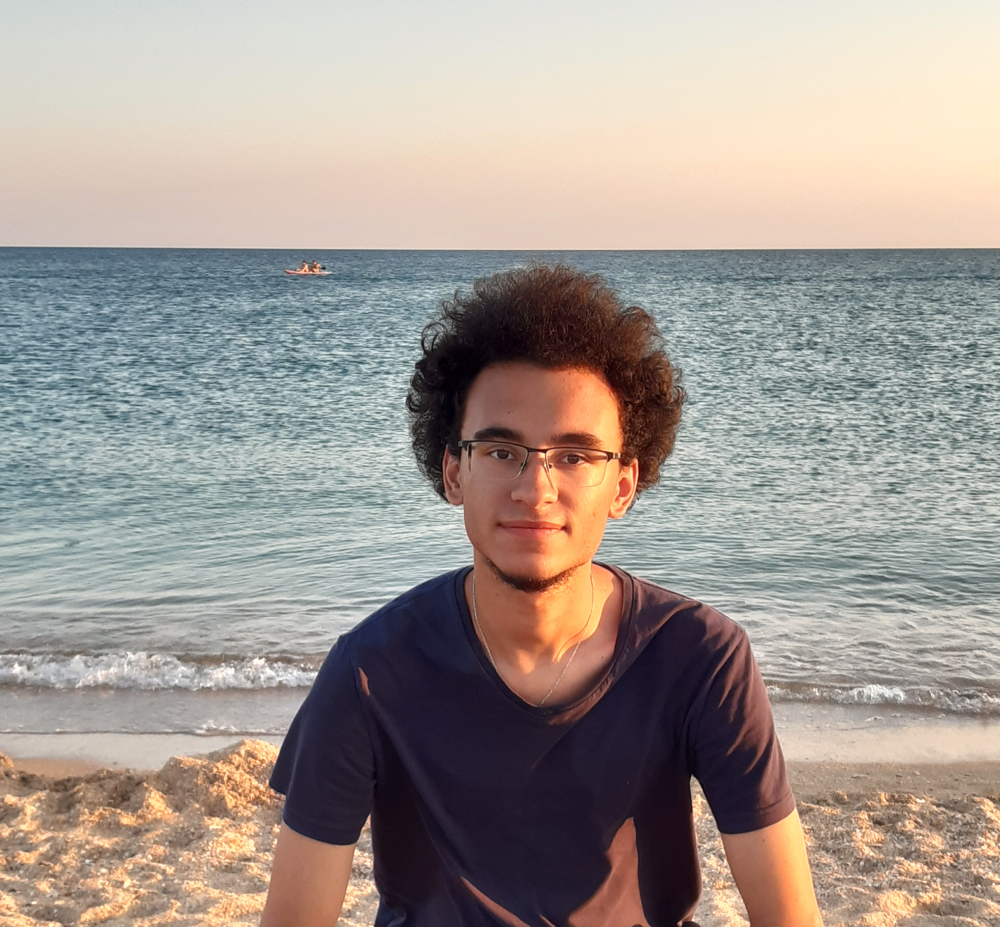
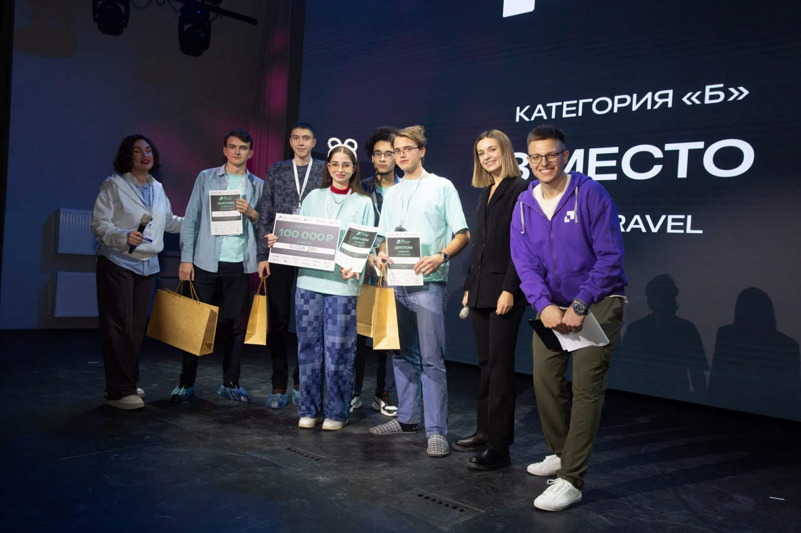
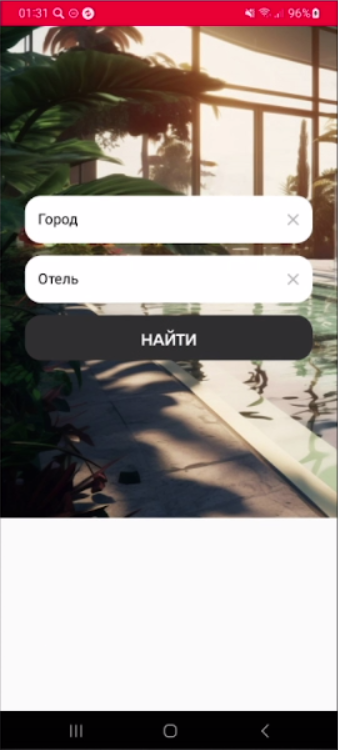
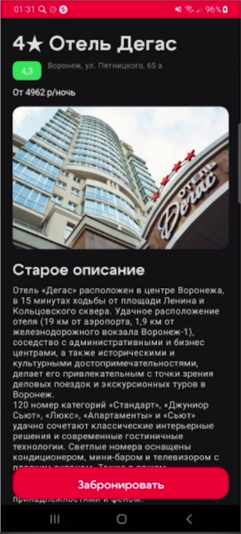
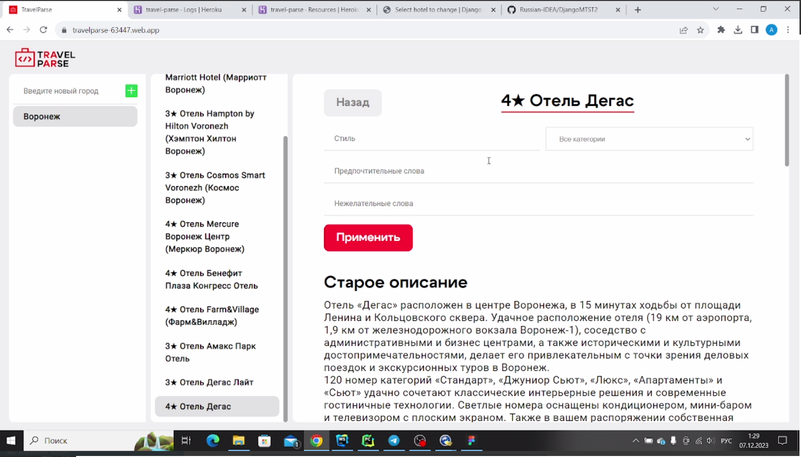
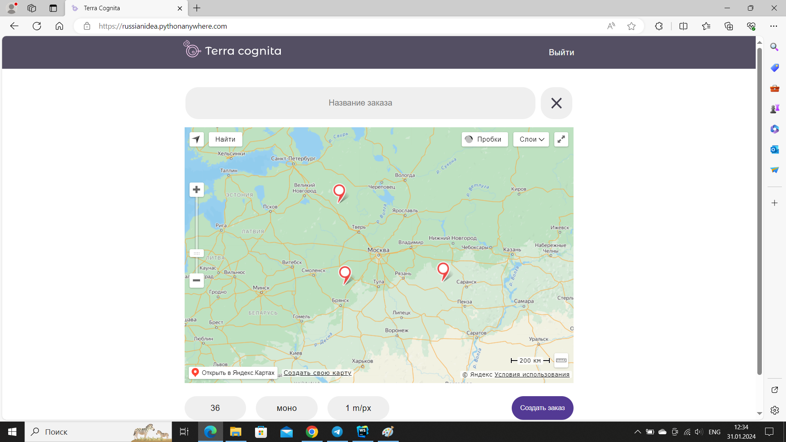
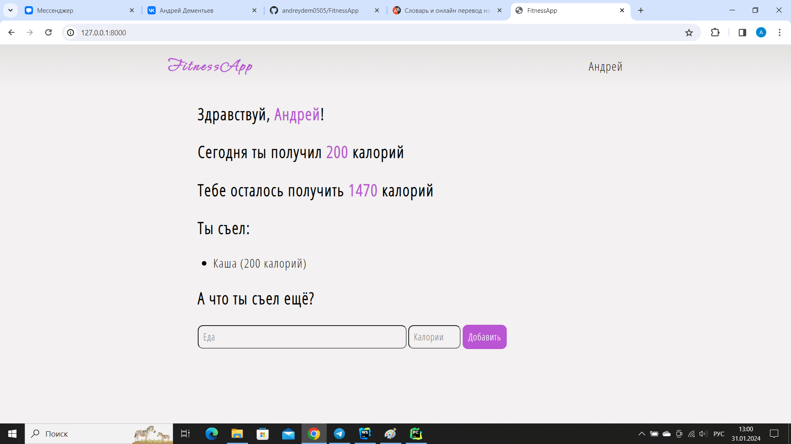
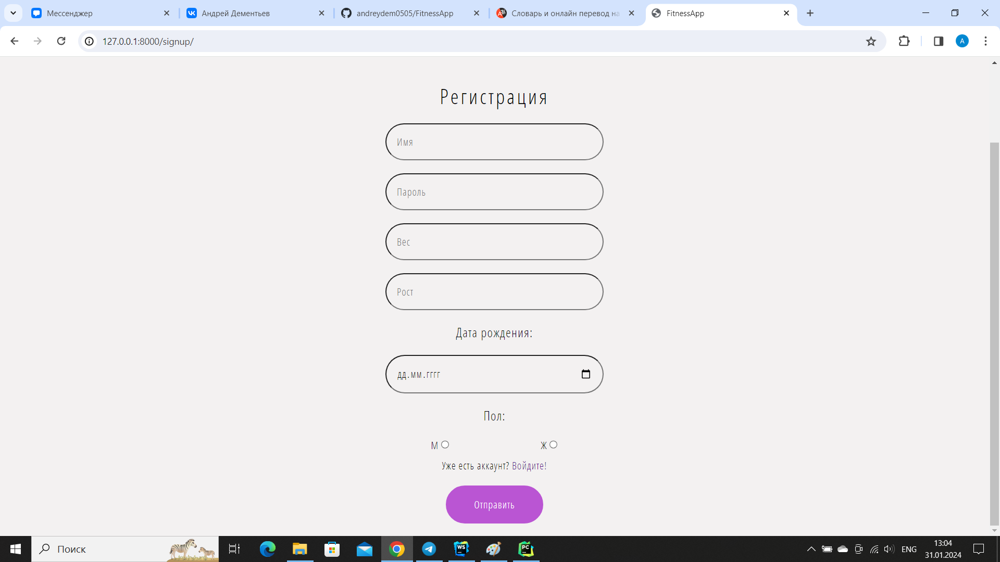
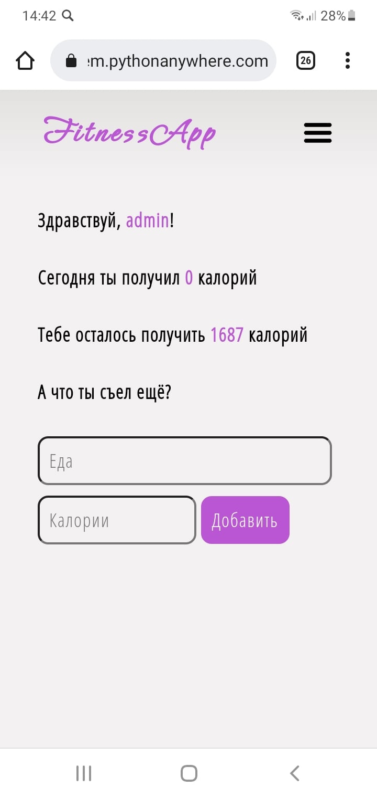

# Дементьев Андрей Дмитриевич

<h3>Воронеж, 18 лет</h3>
<h3>Начинающий фронтенд-разработчик</h3>
<h3>Образование:</h3>
Воронежский государственный университет 
Факультет компьютерных наук 
Направление: программная инженерия 
1 курс
<h3>Скиллы:</h3>
<ul>
    <li>Обучаюсь программированию и разработке уже более 4 лет</li>
    <li>Понимаю, как устроена инфраструктура IT-проектов</li>
    <li>Имею навыки объектно-ориентированного и функционального программирования</li>
    <li>Понимаю принципы хорошего кодинга, такие как SOLID</li>
    <li>Обладаю навыками адаптивной вёрстки</li>
    <li>Имею опыт использования Git в командной разработке</li>
</ul>
<h3>Стек:</h3>
Web: React.js 
Mobile: Jetpack Compose 
Имею опыт работы с Bootstrap, Material Design
<h4>Уровень английского: B2</h4>
<h3>Пройденные курсы:</h3>
<ul>
    <li>IT-школа Samsung</li>
    <li>Kotlin for Android Bootcamp</li>
    <li>Jetbrains Academy</li>
    <li>DSR .NET School</li>
</ul>
<h3>Достижения:</h3>
<ul>
    <li>3-е место в финале всероссийского конкурса "Моя профессия - ИТ"</li>
    
</ul>
<h3>Портфолио:</h3>
<ul>
    <li><a href="https://github.com/andreydem0505/HomeController">Мобильное приложение</a>, контролирующее состояние окружающей среды (Jetpack Compose)</li>
    <li>Фронтенд сервиса для генерации уникальных описаний отелей (Jetpack Compose, React.js)</li>
    
    
    
    <li>Фронтенд сервиса для заказа фотографий со спутников (React.js)</li>
    
    
    <li>Калькулятор калорийности (чистый JS)</li>
    
    
    
</ul>
<h3>Предыдущий опыт работы:</h3>
Фриланс, ссылка на профиль - <a href="https://a24.biz/authors/4805761/">https://a24.biz/authors/4805761/</a>
<h3>Контакты:</h3>
<ul>
    <li>Github: <a href="https://github.com/andreydem0505">https://github.com/andreydem0505</a></li>
    <li>Telegram: <a href="https://t.me/Andreydem42">https://t.me/Andreydem42</a></li>
    <li>VK: <a href="https://vk.com/id565198209">https://vk.com/id565198209</a></li>
    <li>Email: <a href="mailto:andreydem42@gmail.com">andreydem42@gmail.com</a></li>
    <li>Телефон: +79507788171</li>
</ul>